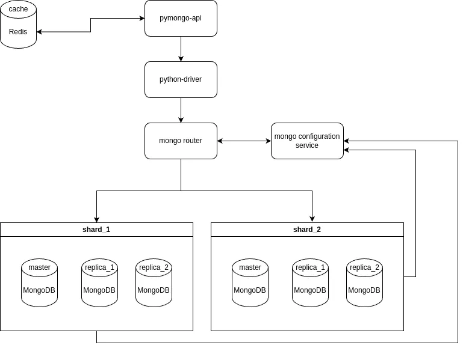
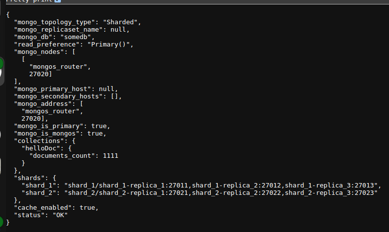

### Общее описание
Проект реализует хранение пользователей с использованием MongoDB и кэшированием


### Компоненты
1. Хранение данных: MongoDB,
    - использует 2 шарда (по хешу имени);
    - на каждый шард реализована репликация (по 3 реплики на шард)
2. Кэширование: Redis
3. Приложение (WebAPI) на python (3.12)

Доступ к хранилищу данных осуществяется через router(mongos_router), который инкапсулирует работу с определенными инстансами БД

Архитектурная схема (показано шардирование+репликация+кэширование):

 [Схемы](https://drive.google.com/file/d/1IiUMlL9th6ZY7AsKI2UWP9fSjVOzrqgu/view?usp=sharing)
  


# Настройка и запуск
в корне проекта выполнить команды
```shell
cd sharding-repl-cache
sudo docker compose up -d
```
Послпе этого дождаться, пока поднимуться контейнеры.

Выполнить настройку БД и инициализацию данных:
```shell
sudo ./scripts/mongo-init.sh
```
если возникнет ошибка подключения (не найден хост или не доступен порт), то нужно подождать пока подимуться все шарды и реплики на них и пройдет кворум, и повторить выполнение команды выше

Результат распределения по-шардам можно проверить командой:
```bash
sudo ./scripts/check_mongo.sh 
```
там можно увидеть примерно равномерное распределение

### Эксплуатация
приложение поднимется на порту 8080 http://<host>:8080 (в случае локального развертывания - `http://localhost:8080`)

Swagger разсположен на endpoint `/docs`
Если перейти по корневому адресу `/`, будет отображена общая информация, например как на рисунке
 

При первом запуске `http://<host>:8080/helloDoc/users` потребуется какое-то время для получения данных (отображения их в браузере); при последующих запросах - данные будут получены сразу, что говорит о том, что кэш работает и получение данных идет из него


<details>
<summary>Первичное описание</summary>
# pymongo-api

## Как запустить

Запускаем mongodb и приложение

```shell
docker compose up -d
```

Заполняем mongodb данными

```shell
./scripts/mongo-init.sh
```

## Как проверить

### Если вы запускаете проект на локальной машине

Откройте в браузере http://localhost:8080

### Если вы запускаете проект на предоставленной виртуальной машине

Узнать белый ip виртуальной машины

```shell
curl --silent http://ifconfig.me
```

Откройте в браузере http://<ip виртуальной машины>:8080

## Доступные эндпоинты

Список доступных эндпоинтов, swagger http://<ip виртуальной машины>:8080/docs


</details>